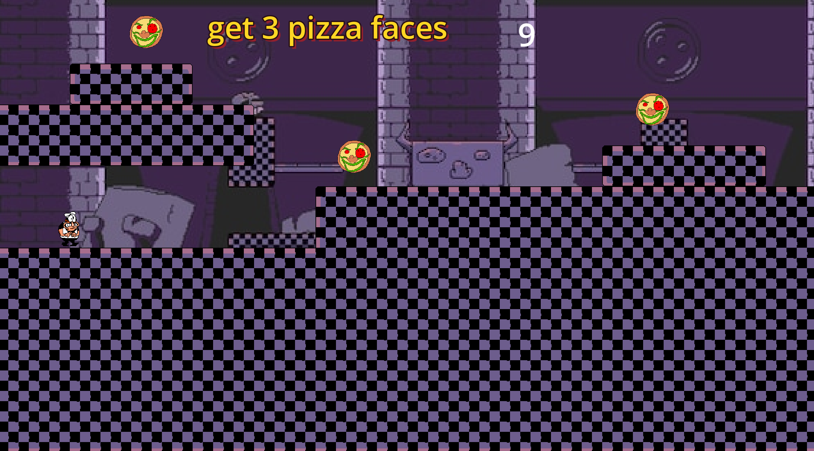
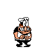
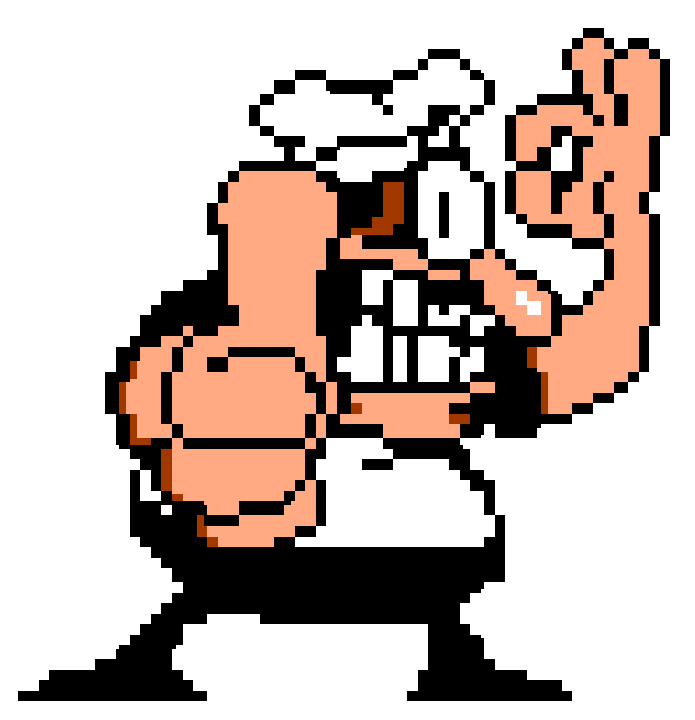
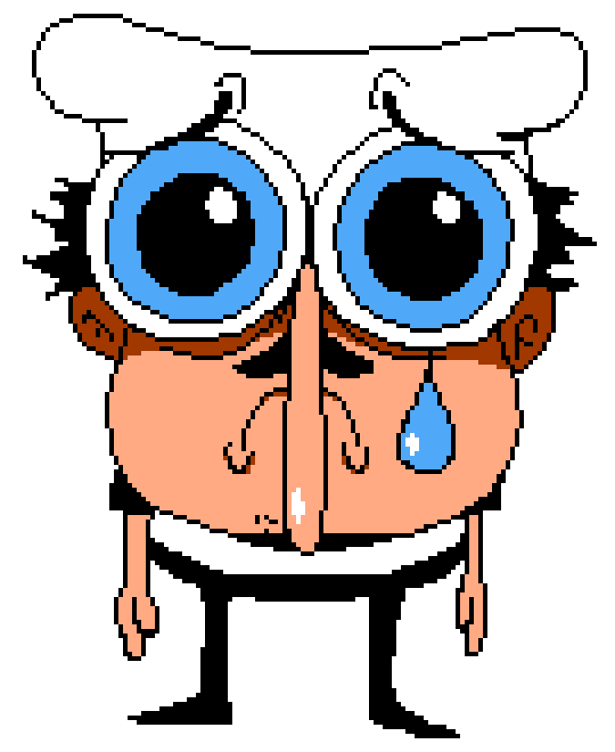

# Pizza tower Ware

a Pizza tower inspired micro game rush thing where you grab pizza faces, click toppings and try not to die

[play it here](https://arjun-bhumula.itch.io/pizza-tower-ware)

## what this even is

its like warioware but pizza tower. you get a prompt, a timer, and 3 lives. if you mess up you lose a life and start the next one anyway (dont lose again). lose all 3 and you get sad peppino. survive the whole set and you get the thumbs up screen.

the games go:

1. platformer — grab 3 pizza faces
2. click 5 toppings
3. platformer — grab 3 again
4. click 5 toppings
5. another platformer
6. click 5 toppings one last time
7. you win i guess

between each one there's a countdown so you can actually read the prompt

## controls

- move sideways using A/D or left and right arrow
- jump using space or up arrow, hold it down for longer jumps
- click toppings with mouse
- move on with ui using space or click

## stuff in the game

- 3 tower / kitchen platformer levels painted on tilemaps so they actually look like pizza tower rooms
- the click 5 toppings game shows up a few times (mushroom cheese tomato sausage pineapple)
- peppino with idle and walk anims
- timers are like 8-10 seconds so you have to hurry
- 3 lives
- countdown between each level
- win screen and lose screen
- the game stays 1280x720 with purple bars if your window is weird

## how i made it

this is a godot 4.7 project (compatibility renderer so the web export doesnt explode)

i built most of it in the editor. the maps are tilemap layers on a 32x32 pizza tower tileset i painted. peppino is a characterbody2d with coyote time so jumping off edges doesnt feel awful. pizza faces are just area2ds you walk into. toppings spawn in a random box so they stay on screen instead of going off into the void.

there's a global autoload that tracks lives and which minigame is next. title / countdown / win / death are their own scenes. then i exported it as html5 and put it on itch.

you can open this folder in godot 4.7.1 and hit f5 if you want. main scene is `scenes/title.tscn`. playing the itch link is way less work tho.

## more pictures

peppino just standing there:

win art:

lose art:

## credits

- me (arjun)
- pizza tower vibes for the art (peppino, kitchen tiles, pizza faces, toppings)
- godot 4.7
